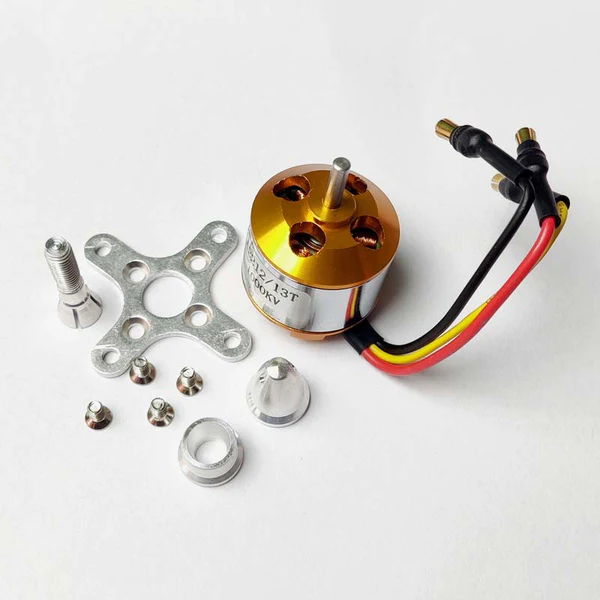
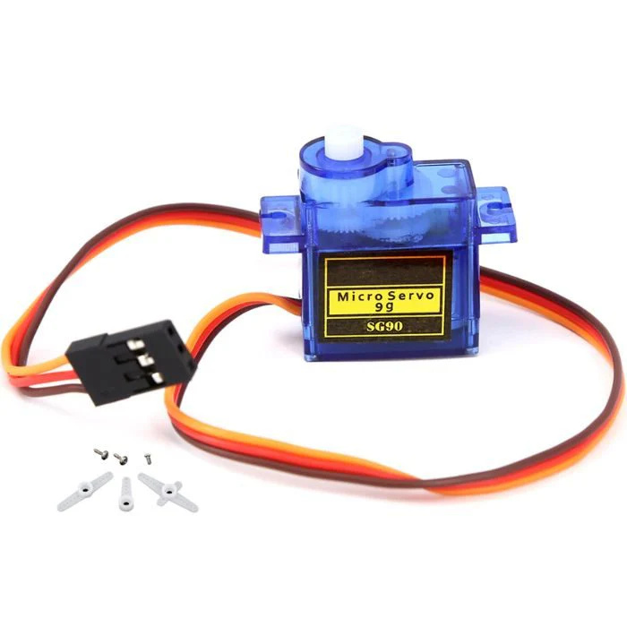

# **TableTennisRobot**

## **Testing of TTBot**

In TTBot, we use three kinds of motors:
1. **3 BLDC motors**
2. **Servo motor**
3. **DC motor** *(Initially we used a stepper motor, later replaced by a DC motor)*

We started by testing each motor individually.

---

## **BLDC Motor**
> *Used for launching the ball*

- Tested the BLDC motor to determine its maximum and minimum speeds.  
- After successful individual testing, integrated the other two BLDC motors and tested all together.  
- Different speeds were configured, allowing continuous operation at constant speed.

✅ **Result:** All BLDC motors are functioning perfectly.

---

## **Servo Motor**
> *Used to change the angle of launching*

- Integrated with BLDC and tested using fixed speed & angle values.  
- Later tested with manual instructions via ROS.

---

## **Stepper Motor**
> *Used to push the ball from the reservoir to the launcher*

- Initial testing was done standalone.  
- After success, integrated with BLDC and Servo motors.

---

## **Integrating All Motors**

- Tested motor integration with fixed values.  
- Then tested with manual serial monitor commands.  
- Also enabled control via ROS.  
- Developed Python script for user-controlled input to drive motors.  

---

## **Final Part: Spin Generation for Table Tennis Practice**

Spin control is key for realistic training. We:

- Created 10 different speed sets.
- Used ROS to select a random set based on user command.  
  
---

## **Automatic Instructions**

- Initially, BLDC speeds were entered manually (e.g., 1000–2000).
- Developed an intuitive input system:
  - `'f'` → forward spin
  - `'b'` → backward spin
  - `'s'` → side spin
  - `'stop'` → reset to initial position

Each spin type uses randomized speed sets, with top-spin increasing by 200 within its range.

- Python script handles these operations.
- Stepper motor was later replaced by DC motor for better performance.

➤ **[automation_via_python.ino](https://github.com/DhinekkaB/TableTennis-Robot/tree/76092e34cdd298d1e07f23b0014b922607234f8f/automation_via_python/automation_via_python)**, 
➤ **[automation.py](https://github.com/DhinekkaB/TableTennis-Robot/blob/7192f7f8b41bf96a1c04c561cedf43644edacddf/automation_via_python/automation.py)**

---

📁 *This README documents all the stages of motor testing, integration, and automation for TTBot.*
